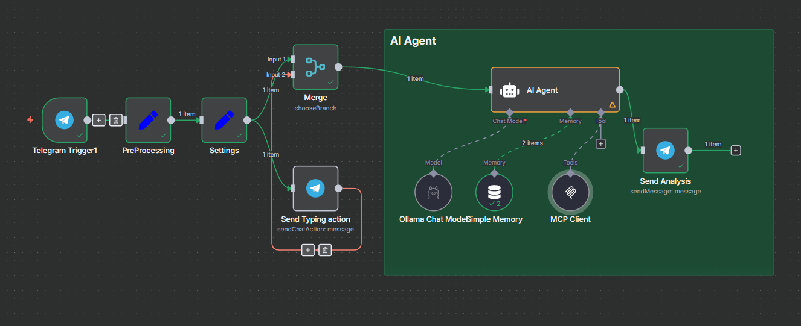

# Spring AI MCP Steam Market with WebMVC Starter

Этот пример проекта демонстрирует, как создать MCP-сервер с помощью программы запуска Spring AI MCP Server Boot Starter. В нем реализовано несколько возможностей торговой площадки, которые предоставляет инструменты для получения информации о скинах,кейсах и их ценах с помощью Steam API.

Для получения дополнительной информации обратитесь к справочной документации [MCP Server Boot Starter](https://docs.spring.io/spring-ai/reference/api/mcp/mcp-server-boot-starter-docs.html) reference documentation.

## В docker-compose можете найти такие компоненты
1. postgres (база даных для n8n)
2. nginx (пока не работает, кривая конфигурация)
3. n8n (Платформа для автоматизация рабочего процесса с использованием искусственного интеллекта)
4. ollama (модель для AI agent, в качестве примера)
5. steam-market-mcp-server (MCP Server для получения информации о скинах, кейсах и т.д)
6. mcp-inspector (для отладки MCP Server)

